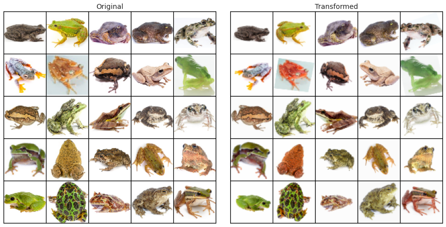
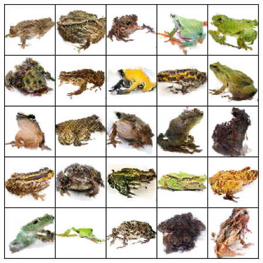

# Frogs GAN
Experiments with basic GANs and attempt to generate frogs images using them.

## Data
[Frog Dataset](https://github.com/jonshamir/frog-dataset) was used, which contains frog images (mainly) on the white background of sizes 64x64 and 224x224. It also contains raw pictures and a script for preprocessing, but it wasn't the case for my experiments.

## Augmentation • [nbviewer](https://nbviewer.jupyter.org/github/andrii0yerko/frogs-gan/blob/main/AugmentationOverview.ipynb) • [Google Colab](https://colab.research.google.com/github/andrii0yerko/frogs-gan/blob/main/AugmentationOverview.ipynb)
Data loading consists of random augmentation of 224x224 images, resizing them to 64x64, and using a gaussian blur to make them more smooth (looks like discriminator can easily overfit to sharp edges)

## Trained models
Models are trained on Google Colab (with Tesla T4)

Time per epoch includes time spent on data loading and preprocessing, which should be the same for all the runs.

| Model | Time per epoch | Best checkpoint | FID | IS | best FID |
|---:|--:|--:|--:|--:|--:|
| **DCGAN** | 56.08 s | 1000 | 54.1756 | 4.7795 | 47.7449 (1180) |
| **SNGAN** | 57.13 s | 1200 | 54.9516 | 4.7813 | 52.9301 (1340) |
### DCGAN • [nbviewer](https://nbviewer.jupyter.org/github/andrii0yerko/frogs-gan/blob/main/Frogs_DCGAN.ipynb) • [Google Colab](https://colab.research.google.com/github/andrii0yerko/frogs-gan/blob/main/Frogs_DCGAN.ipynb)

### SNGAN • [nbviewer](https://nbviewer.jupyter.org/github/andrii0yerko/frogs-gan/blob/main/Frogs_SNGAN.ipynb) • [Google Colab](https://colab.research.google.com/github/andrii0yerko/frogs-gan/blob/main/Frogs_SNGAN.ipynb)

## First version (with much simpler augmentation)
Left for comparison.
> ### 1. DCGAN with PyTorch
> 
> [nbviewer](https://nbviewer.jupyter.org/github/andrii0yerko/frogs-gan/blob/main/deprecated/01_DCGAN_with_PyTorch.ipynb), [Google Colab](https://colab.research.google.com/github/andrii0yerko/frogs-gan/blob/main/deprecated/01_DCGAN_with_PyTorch.ipynb)
> 
> Attempt to build a Deep Convolutional GAN with original architecture to generate pictures of frogs 64x64.

